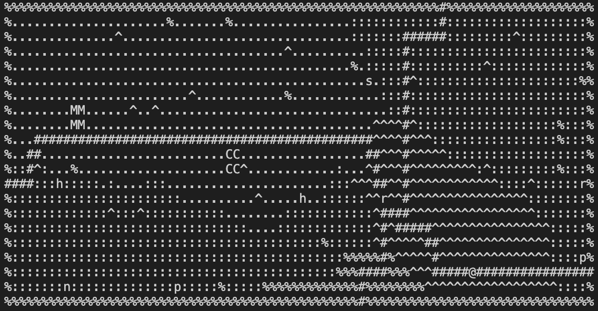

INSTALLATION:
Download and unpack cobb_jaydon.assignment-1.05.tar.gz files to directory
CD into directory
Run "make"
Run ./poke327

START GAME:
Press any of the below controls for NPC's to spawn in and begin the game.

CONTROLS:
7/y: Move one cell to the upper left.
8/k: Move one cell up.
9/u: Move one cell to the upper right.
6/l: Move one cell to the right.
3/n: Move one cell to the lower right:
2/j: Move one cell down.
1/b: Move one cell to the lower left.
4/h: Move one cell to the left.
t: Show trainer locations on map.
esc: return to previous screen.
Q: Quit game.

PokeMart/PokeCenter:
Move into 'M' or 'C' cell and press '>' to enter.
Escape button to leave

MISC:
Game will end if any map exits are attempted (for now).

